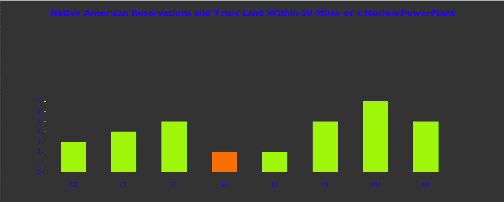

<html>
	<head>
	</head>
	<body>
		<h1>DATA VISUALIZATION</h1>
		
The data for this chart represents Native American reserves located near coal mines. 
			<section>
				
The bars turn orange when a mouse hovers over them. When a bar is clicked the reservation's states appear, and the bar turns blue. Completed 03/13/2020.

					 
	</body>
</html>
