<html>
	<head>
	</head>
	<body>
		<header>
			<section>
				<h1>PROCESSING 101</h1>
				<h5>Go to <a href="https://hello.processing.org/editor/">Processing</a> and enter the code for animated/interactive projects
				</h5>
					
This is my attempt at using processing to make a face. 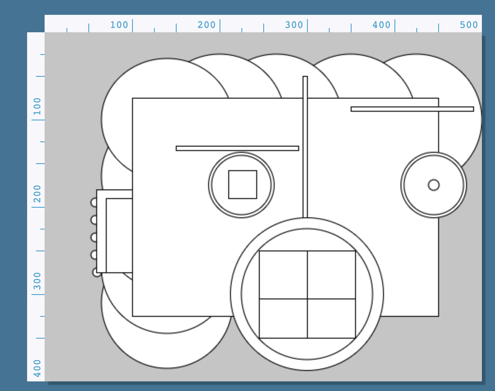 
Here's the code for that project. 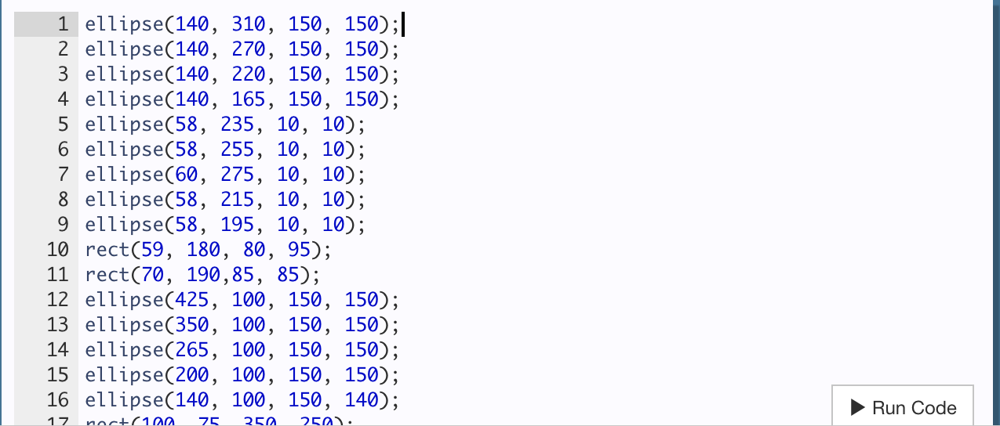
			</section>
			<section>
				<h5>I took even more time playing with color. 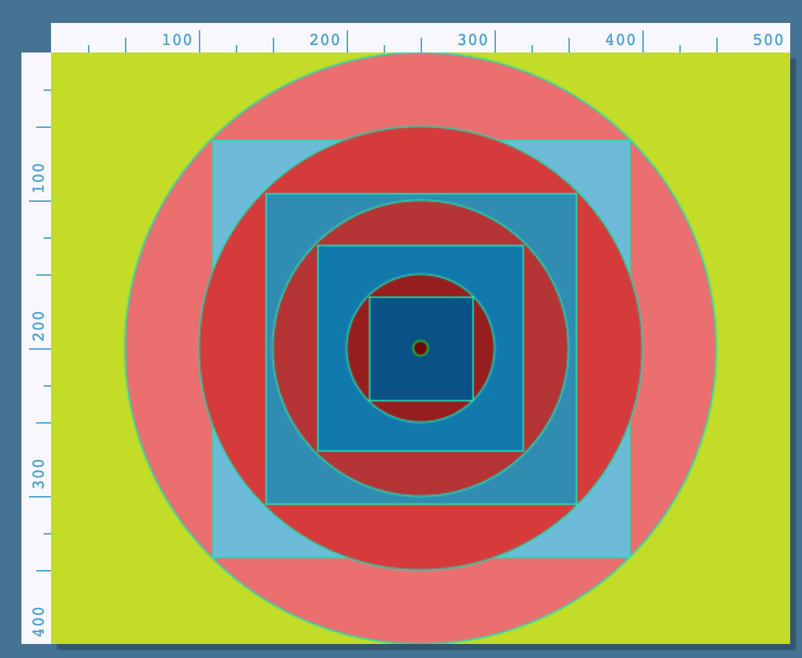 
Project code. 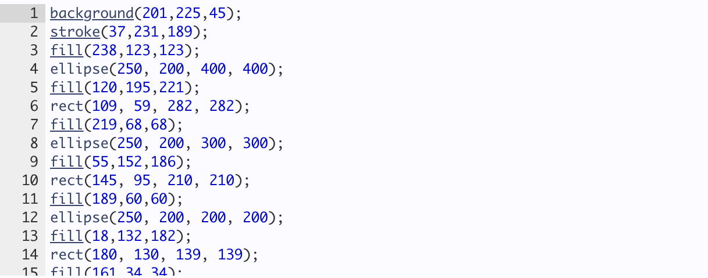 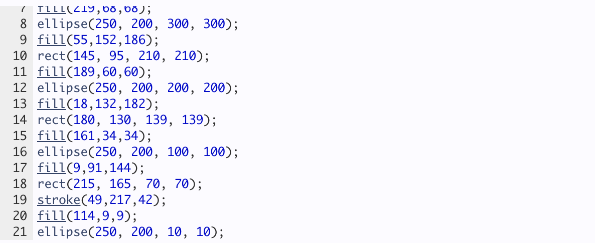
				

			</section>
			<section>
				<h5>Then we moved to animations. 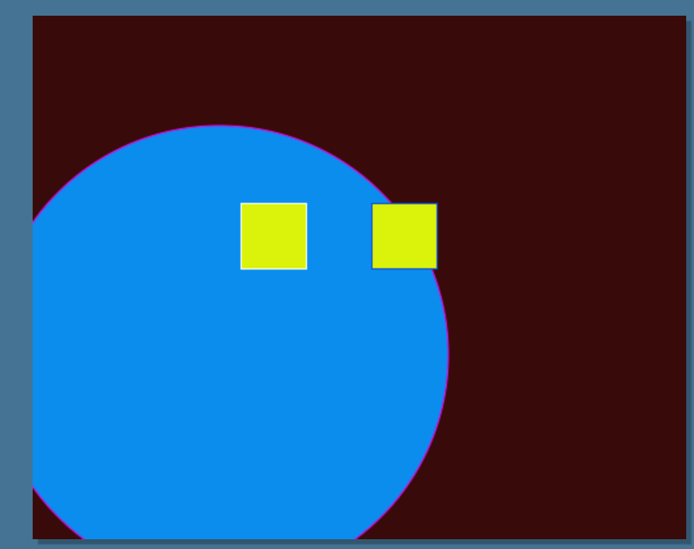 
Project code. 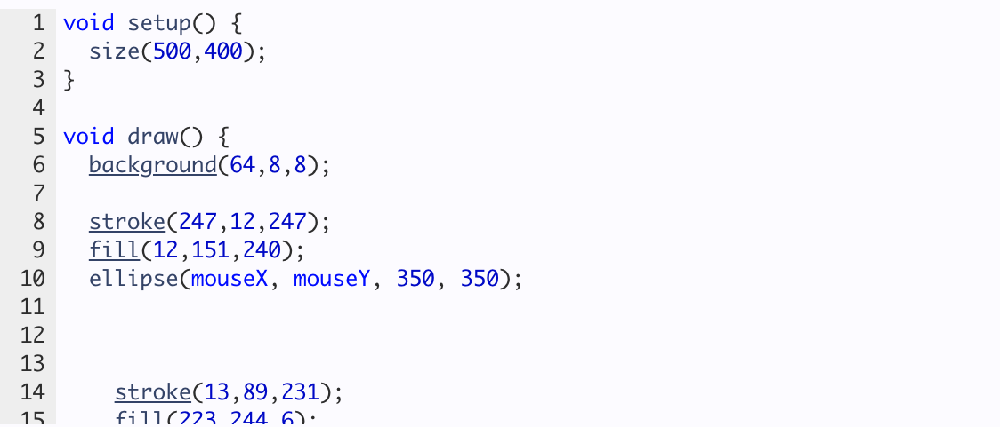 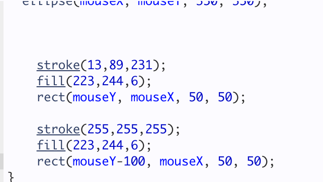
				

			</section>
			<section>
				<h5>Interactions were even better. 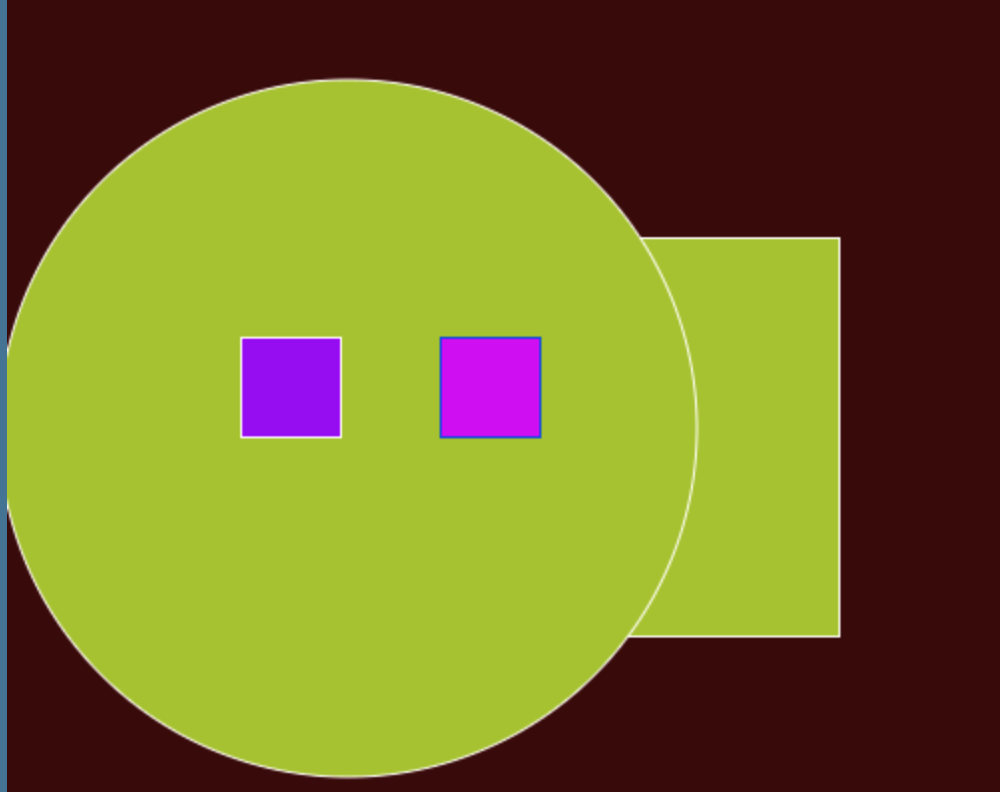 
Project code. 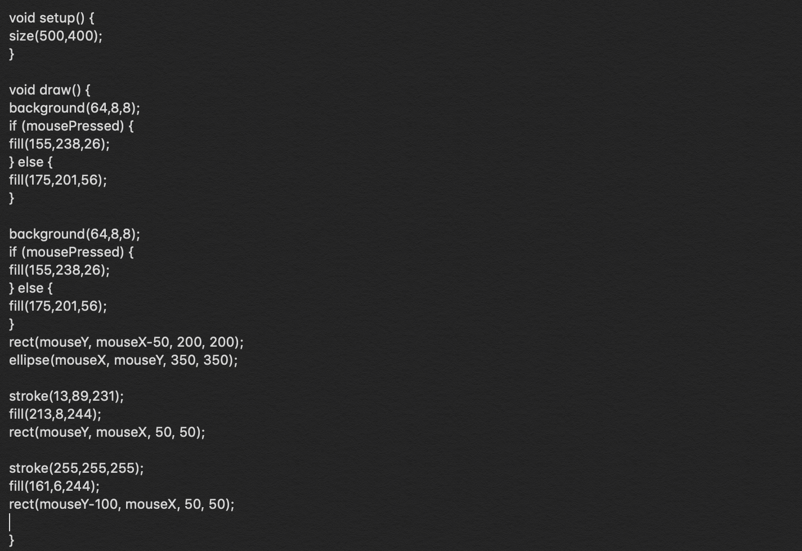 
				

			</section>
			<section>
				<h5>Finally, an original design using the different aspects of processing was created. 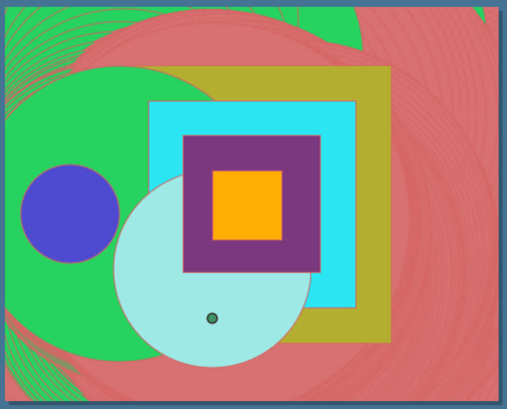 
Project code. 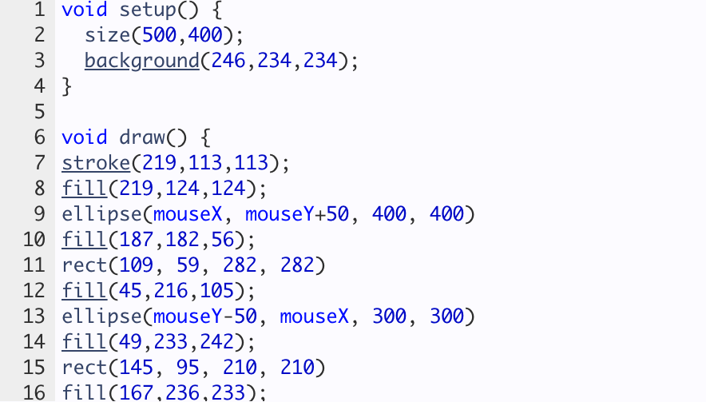 
				

			</section>
		</header>
	</body>
</html>
