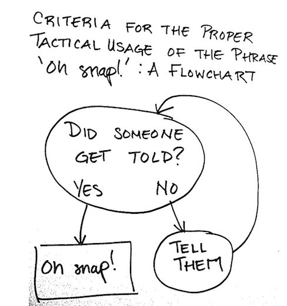
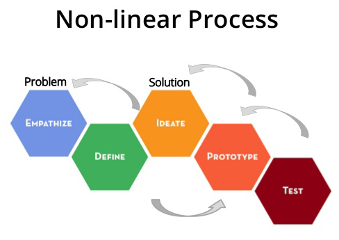
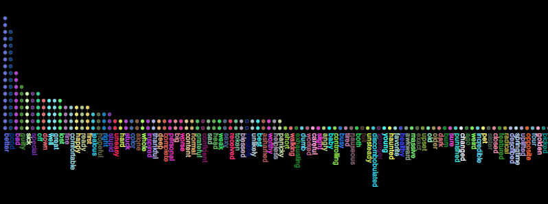

<!DOCTYPE html>
<html>
	<head>
	</head>
	<body>
		<header>
		<header class="primary-header container group">
		<h1>Rebecca's Semester in Code</h1>
		<h3>Enjoy viewing an online portfolio of my work from the Spring 2020 semester!</h3>
		</header>
		<section>
			<h4>Learning to Code Leads to Possibilities</h4>
			
 I've wanted to learn how to code for a while now. This class helped me realize all you need is time, dedication, and a decent computer to learn the basics.

		</section>
		<section>
			<section class="teaser col-1-3">
				<h3>Pseudo Code</h3>
				<a href="PsuedoCode.md">B@sic, B@sic Thingz
					
				</a>		
			</section>
			<section class"teaser col-l-3">
				<h3>Flow Chart a Process</h3>
				<a href="FlowChartAProcess.md">Flow charts R useful and C00l
					
				</a>	
			</section>
			<section>
				<h3>Non-Linear Processes</h3>
				<a href="NonLinearProcesses.md">Twine is Gr8t 4 Beginners
					
				</a>
			</section>
			<section>
				<h3>Processing</h3>
				<a href="Processing.md">Took a bit l0ng3r than building a snowman.
					
				</a>
			</section>
			<section>
				<h3>Data Visualization</h3>
				<a href="DataVisualization.md"> D@ta is B3ttr 2 C.
					
				</a>
			</section>
			<section>
				<h4>HTML & CSS I</h4>
				<a href="index3.html">All of my Work got D3l3t3d:)
					
				</a>
			</section>
		</section>		
	</body>
</html>
